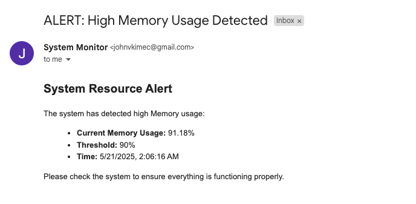
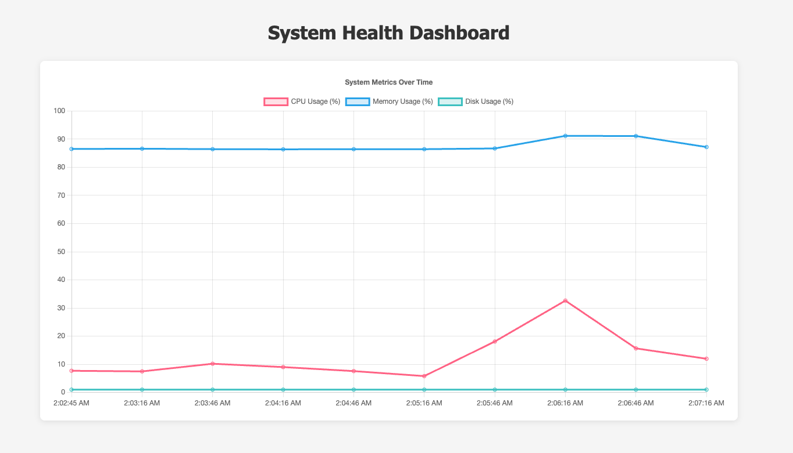

# system-health-dashboard

A Node.js-based dashboard for monitoring system CPU, memory, and disk usage, with alerting and historical data visualization.

## Screenshots

### Email Alert Example


### Dashboard UI Example


## Features
- Collects and stores system metrics (CPU, memory, disk) in a SQLite database
- Displays metrics history in a web dashboard
- Sends email alerts when thresholds are exceeded
- Configurable thresholds and alert settings

## Prerequisites
- Node.js (v14 or higher recommended)
- npm (Node package manager)
- sqlite3 (Node.js package and command-line tool)

  - The Node.js package is installed automatically with `npm install`.
  - The command-line tool is required only if you want to inspect the database manually.

## Setup Instructions

### 1. Clone the Repository
```
git clone <your-repo-url>
cd system-health-dashboard
```

### 2. Install Dependencies
```
npm install
```

### 3. Configure Environment Variables
Create a `.env` file in the root directory with the following content:
```
SMTP_HOST=smtp.gmail.com
SMTP_PORT=587
SMTP_SECURE=false
SMTP_USER=your_email@gmail.com
SMTP_PASS=your_app_password
ALERT_TO=recipient_email@gmail.com
```
- Use an [App Password](https://support.google.com/accounts/answer/185833?hl=en) if using Gmail.
- Set `SMTP_SECURE=false` for port 587 (STARTTLS), or `true` for port 465 (SSL).

### 4. Configure Alert Thresholds
Edit `config/thresholds.json` to set your desired alert thresholds:
```
{
  "cpu": 80,
  "memory": 90,
  "disk": 90
}
```

### 5. Run the Application
```
node server.js
```
- The dashboard will be available at [http://localhost:3000](http://localhost:3000)
- Metrics will be collected and stored automatically.
- Alerts will be sent if thresholds are exceeded.

### 6. Database
- The SQLite database file (`system_metrics.db`) is created automatically in the project root.
- All metrics are wiped from the database when the server is shut down (Ctrl+C).
- To inspect the database manually:
  ```
  sqlite3 system_metrics.db
  .tables
  SELECT * FROM metrics;
  ```